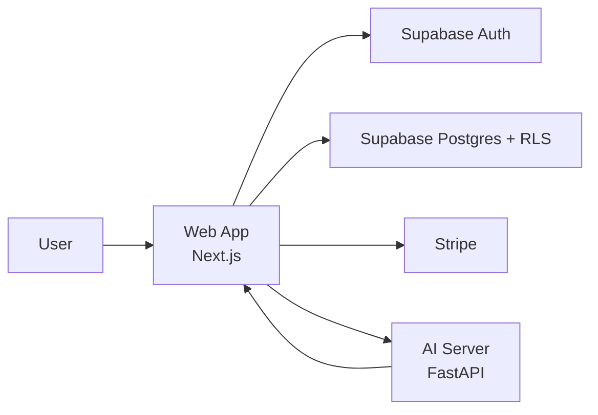
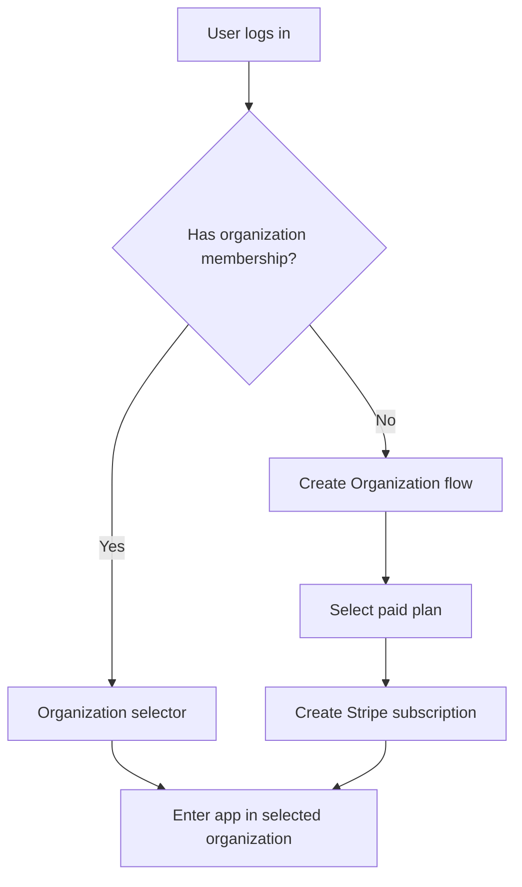

# Vokos - Architecture

## 1. Scope

This document defines the current product architecture and onboarding model for Vokos.

Primary references:
- `docs/PRODUCT_VISION.md`
- `docs/SECURITY.md`
- `docs/DATABASE_SCHEMA.md`
- `.cursor/rules.md`

## 2. Architecture Goals

- enforce strict multi-tenant isolation
- support organization-based billing and limits
- keep Kanban execution flows fast for legal teams
- preserve traceability for critical operations
- allow product expansion to granular permissions (V2 RBAC)

## 3. High-Level Architecture

Main components:
- `apps/web` (Next.js App Router): UI, authenticated app flows, server actions, webhook handlers
- `services/ai_server` (FastAPI): parsing + structured extraction from legal communications (Google Gemini)
- Supabase (Auth + Postgres + RLS): identity, membership, and transactional data
- Stripe: financial source of truth for paid organizations
- Resend: transactional email delivery for organization invitations



## 4. Onboarding and Access Flow

Rules:
- user account is free
- product usage requires paid organization membership
- membership comes from organization creation or invitation acceptance



## 5. Tenant and Domain Hierarchy

```text
User
  -> Organization
    -> Workspaces
      -> Boards
        -> Lists
          -> Tasks
```

Architecture boundaries:
- `Organization` is the billing and membership boundary.
- `Workspace` is the operational isolation boundary used by app domain data access.
- Domain reads/writes for boards/lists/tasks must remain scoped by `workspace_id`.

## 6. Subscription and Billing Model

Hard rules:
- each organization maps to exactly one Stripe subscription
- a user may own multiple organizations
- each owned organization has an independent subscription lifecycle
- plan limits are enforced per organization

Plan-limited dimensions:
- users
- workspaces
- monitored processes

Backend responsibilities:
- verify Stripe webhook signatures
- enforce webhook idempotency
- mirror subscription state into billing tables
- block or gate actions that exceed organization plan limits

## 7. Permission Model

### 7.1 MVP permissions
Only organization owner can:
- create workspaces
- invite members
- remove members

Members can:
- view boards
- move tasks
- edit tasks

Members cannot:
- create workspaces
- invite users
- delete organization

### 7.2 V2 roadmap (documented only)
Planned granular permissions:
- create workspaces
- invite users
- remove users
- delete tasks
- manage boards

This requires a more advanced RBAC layer than MVP owner/member controls.

## 8. Invitation Architecture

Invitation flow:
1. owner invites by email
2. system creates pending invitation tied to organization
3. system sends invitation email through Resend with secure acceptance link
4. user signs up or logs in through the invitation flow
5. invitation is resolved and membership is activated idempotently

Security notes:
- invitation acceptance must validate token and intended email
- membership creation must be idempotent
- audit trail must record invite, accept, revoke

## 9. AI and Task Automation Boundary

MVP ingestion source:
- email-first legal communication flow
- Google Gemini is the current extraction provider

Pipeline:
1. ingestion captured in app backend
2. sanitized payload sent to AI server
3. AI server returns structured extraction
4. web backend validates and persists tasks

Constraints:
- AI server does not write directly to Postgres
- AI server does not access user sessions
- customer mailbox integrations are read-only

## 10. Data and Isolation Rules

- RLS enabled for tenant tables
- organization/workspace relation must be consistent on writes
- task operations must remain board/list/workspace consistent
- critical mutations append audit events

## 11. Deployment Model

- Web app: Vercel
- AI server: managed container runtime
- Database/Auth: Supabase
- Payments: Stripe

Environments:
- local
- preview
- production

## 12. Architecture Decisions Locked for Current Product Model

- onboarding is organization-first after login
- billing is subscription-per-organization
- limits are organization-level and enforced in backend
- operational task domain remains workspace-scoped
