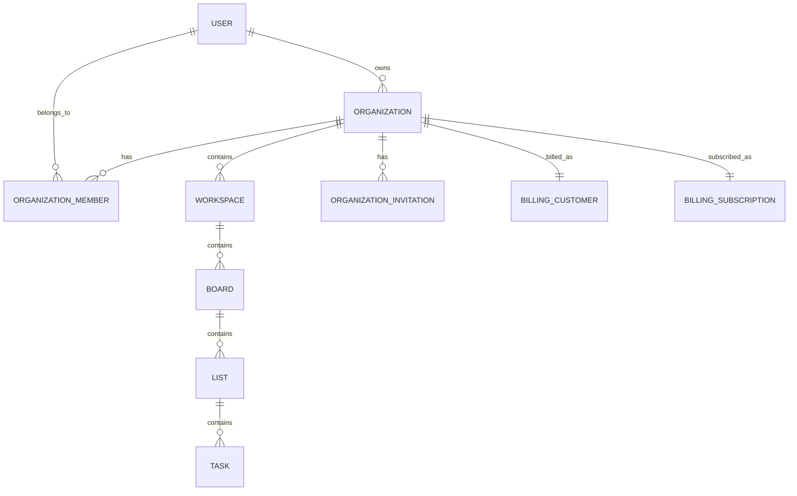

# Vokos - Database Schema

## 1. Scope

This document defines the current data model for:
- free user accounts
- paid organizations
- workspace-based Kanban operations
- Stripe subscription synchronization
- per-organization plan limit enforcement

Primary references:
- `docs/PRODUCT_VISION.md`
- `docs/ARCHITECTURE.md`
- `docs/SECURITY.md`
- `.cursor/rules.md`

## 2. Core Data Rules

Mandatory rules:
- `organization` is the billing and membership boundary
- each organization maps to exactly one Stripe subscription
- plan limits are enforced per organization
- operational task-domain tables remain workspace-scoped (`workspace_id`)
- RLS is enabled for tenant tables
- critical actions are auditable

Global conventions:
- UUID primary keys (`id uuid`)
- `created_at timestamptz default now()`
- `updated_at timestamptz default now()` on mutable tables

## 3. Hierarchy and Entity Map

## 4. Enums

Recommended enums:
- `organization_role`: `owner`, `member`
- `invitation_status`: `pending`, `accepted`, `expired`, `revoked`
- `plan_code`: `essencial`, `equipe`, `enterprise`
- `subscription_status`: `incomplete`, `trialing`, `active`, `past_due`, `canceled`, `unpaid`
- `created_by_type`: `human`, `bot`, `system`
- `source_type`: `manual`, `email`, `tribunal`, `portal`
- `task_priority`: `low`, `medium`, `high`, `urgent`

## 5. Identity, Organization, and Billing Tables

### 5.1 organizations
Purpose:
- law firm container and billing anchor

Fields:
- `id`
- `name`
- `slug` (unique)
- `owner_user_id` -> `auth.users.id`
- `active_plan plan_code`
- `status` (`active`, `suspended`, `canceled`)
- timestamps

Indexes:
- unique(`slug`)
- index(`owner_user_id`)
- index(`active_plan`)

### 5.2 organization_members
Purpose:
- membership and role assignment by organization

Fields:
- `id`
- `organization_id` -> `organizations.id`
- `user_id` -> `auth.users.id`
- `role organization_role`
- `is_active boolean default true`
- `invited_by_user_id` (nullable)
- `joined_at` (nullable)
- timestamps

Constraints and indexes:
- unique(`organization_id`, `user_id`)
- index(`user_id`)
- index(`organization_id`, `role`)

### 5.3 organization_invitations
Purpose:
- email invitation lifecycle

Fields:
- `id`
- `organization_id` -> `organizations.id`
- `email`
- `invited_by_user_id`
- `token_hash`
- `status invitation_status`
- `expires_at`
- `accepted_at` (nullable)
- `accepted_user_id` (nullable)
- timestamps

Constraints and indexes:
- unique(`organization_id`, `email`) where `status='pending'`
- index(`organization_id`, `status`)
- index(`email`)

### 5.4 billing_customers
Purpose:
- Stripe customer mapping

Fields:
- `organization_id` (pk, fk -> `organizations.id`)
- `stripe_customer_id` (unique)
- timestamps

### 5.5 billing_subscriptions
Purpose:
- one subscription per organization

Fields:
- `id`
- `organization_id` (unique, fk -> `organizations.id`)
- `stripe_subscription_id` (unique)
- `stripe_price_id`
- `plan_code plan_code`
- `status subscription_status`
- `current_period_start` (nullable)
- `current_period_end` (nullable)
- `cancel_at_period_end boolean default false`
- `canceled_at` (nullable)
- `metadata jsonb` (nullable)
- timestamps

Indexes:
- unique(`organization_id`)
- index(`status`)

### 5.6 billing_events
Purpose:
- webhook idempotency and processing history

Fields:
- `id`
- `stripe_event_id` (unique)
- `organization_id` (nullable)
- `type`
- `payload jsonb`
- `received_at`
- `processed_at` (nullable)
- `error` (nullable)

## 6. Plan Limit and Usage Tables

### 6.1 plan_limits (reference)
Purpose:
- canonical limits by plan

Fields:
- `plan_code` (pk)
- `max_users` (nullable for unlimited)
- `max_workspaces` (nullable for unlimited)
- `max_monitored_processes` (nullable for unlimited)

Required records:
- `essencial`: users 1, workspaces 1, processes 40
- `equipe`: users 5, workspaces 5, processes 300
- `enterprise`: unlimited

### 6.2 organization_usage
Purpose:
- fast counters for enforcement

Fields:
- `organization_id` (pk)
- `active_users_count`
- `active_workspaces_count`
- `monitored_processes_count`
- `updated_at`

Rules:
- counters are derived server-side
- client-provided counts are never trusted

## 7. Workspace and Kanban Domain Tables

### 7.1 workspaces
Fields:
- `id`
- `organization_id` -> `organizations.id`
- `name`
- `slug`
- `is_archived boolean default false`
- timestamps

Constraints and indexes:
- unique(`organization_id`, `slug`)
- index(`organization_id`)

### 7.2 boards
Fields:
- `id`
- `organization_id` -> `organizations.id`
- `workspace_id` -> `workspaces.id`
- `name`
- `description` (nullable)
- `is_default boolean default false`
- timestamps

Indexes:
- index(`organization_id`, `workspace_id`)

### 7.3 lists
Fields:
- `id`
- `organization_id` -> `organizations.id`
- `workspace_id` -> `workspaces.id`
- `board_id` -> `boards.id`
- `name`
- `position int`
- `is_archived boolean default false`
- timestamps

Constraints and indexes:
- unique(`board_id`, `position`)
- index(`workspace_id`, `board_id`)

### 7.4 tasks
Fields:
- `id`
- `organization_id` -> `organizations.id`
- `workspace_id` -> `workspaces.id`
- `board_id` -> `boards.id`
- `list_id` -> `lists.id`
- `title`
- `description` (nullable)
- `position numeric`
- `due_date` (nullable)
- `priority task_priority` (nullable)
- `assignee_user_id` (nullable)
- `is_archived boolean default false`
- `created_by_type created_by_type`
- `created_by_user_id` (nullable)
- `source_type source_type default 'manual'`
- `source_ref_id` (nullable)
- `source_summary` (nullable)
- `confidence numeric` (nullable)
- `edited_count int default 0`
- `last_edited_at` (nullable)
- `last_edited_by_user_id` (nullable)
- timestamps

Indexes:
- index(`workspace_id`, `board_id`, `list_id`)
- index(`workspace_id`, `assignee_user_id`)
- index(`workspace_id`, `due_date`)

### 7.5 task_comments
Fields:
- `id`
- `organization_id` -> `organizations.id`
- `workspace_id` -> `workspaces.id`
- `task_id` -> `tasks.id`
- `author_user_id` -> `auth.users.id`
- `body text`
- timestamps

Indexes:
- index(`workspace_id`, `task_id`, `created_at`)

## 8. Monitored Process Tracking

### 8.1 monitored_processes
Purpose:
- track processes counted against plan limits

Fields:
- `id`
- `organization_id` -> `organizations.id`
- `workspace_id` -> `workspaces.id`
- `process_number`
- `source` (`email`, `tribunal`, `manual`)
- `status` (`active`, `archived`)
- `first_seen_at`
- `last_seen_at` (nullable)
- timestamps

Constraints and indexes:
- unique(`organization_id`, `process_number`)
- index(`organization_id`, `status`)
- index(`workspace_id`, `status`)

## 9. Audit Tables

### 9.1 audit_events
Fields:
- `id`
- `organization_id` -> `organizations.id`
- `workspace_id` (nullable)
- `entity_type`
- `entity_id`
- `action`
- `actor_type created_by_type`
- `actor_user_id` (nullable)
- `occurred_at`
- `diff_json jsonb` (nullable)
- `metadata jsonb` (nullable)

Indexes:
- index(`organization_id`, `occurred_at desc`)
- index(`workspace_id`, `occurred_at desc`)
- index(`entity_type`, `entity_id`, `occurred_at desc`)

Immutability:
- prevent UPDATE/DELETE via policy or trigger

## 10. Integrity Requirements

Required consistency checks:
- `workspaces.organization_id` must match parent organization
- `boards/lists/tasks/comments` organization/workspace chain must match
- `billing_subscriptions.organization_id` is unique (one subscription per organization)
- owner membership must exist for `organizations.owner_user_id`

Enforcement approach:
- DB constraints + triggers for invariants
- backend validations for business-level checks

## 11. RLS Baseline

RLS policy principles:
- organization-level tables: member of organization required
- workspace-level tables: member of organization + valid workspace linkage
- owner-only mutations enforced in backend (MVP)

Policy baseline:
- `SELECT`: organization member only
- `INSERT/UPDATE/DELETE`: authenticated member with backend role checks

## 12. Plan Enforcement Rules (Backend + DB)

Enforcement points:
- before adding a member, check `max_users`
- before creating workspace, check `max_workspaces`
- before activating monitored process, check `max_monitored_processes`

Operational requirements:
- transactional checks to avoid race-condition overages
- hard denial on exceeded limits
- audit denied actions with reason and counters

## 13. V2 RBAC Extension (Documented, Not Implemented)

Future schema extension for granular permissions:
- `permissions` catalog
- `organization_member_permissions` mapping
- optional role templates per organization

Target permission examples:
- create workspaces
- invite users
- remove users
- delete tasks
- manage boards
